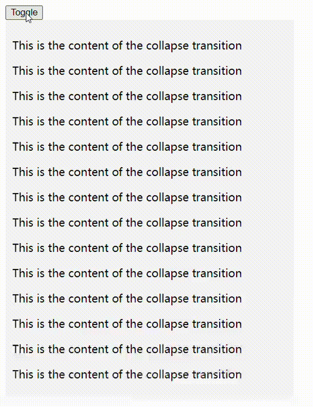

# CollapseTransition

基于VueTransition的Collapse折叠面板小组件

## 安装

```
npm i @daisy-wong/collapsetransition
```

## 使用

```
// module
import CollapseTransition from '@daisy-wong/collapsetransition'

// browser
<script src="./dist/collapsetransition.umd.cjs"></script>
<script>
    Vue.component('CollapseTransition', CollapseTransition)
</script>
```

```vue
<CollapseTransition>
    <div v-show="show" style="padding: 100px 0;">
        <p>This is the content of the collapse transition</p>
        <p>This is the content of the collapse transition</p>
        <p>This is the content of the collapse transition</p>
        <p>This is the content of the collapse transition</p>
        <p>This is the content of the collapse transition</p>
        <p>This is the content of the collapse transition</p>
        <p>This is the content of the collapse transition</p>
        <p>This is the content of the collapse transition</p>
        <p>This is the content of the collapse transition</p>
        <p>This is the content of the collapse transition</p>
        <p>This is the content of the collapse transition</p>
        <p>This is the content of the collapse transition</p>
        <p>This is the content of the collapse transition</p>
        <p>This is the content of the collapse transition</p>
    </div>
</CollapseTransition>
```

## 效果

